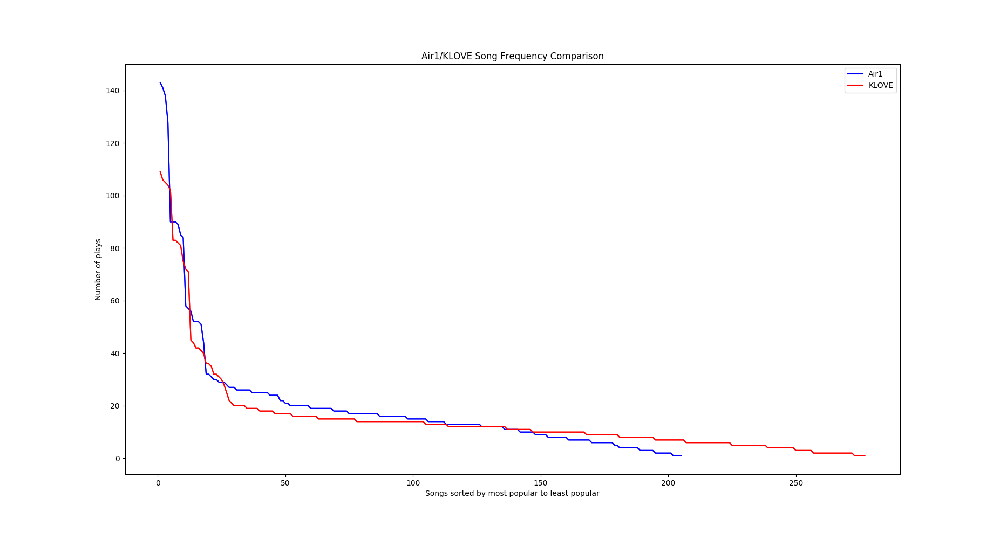

# Results

### Most Important
- KLOVE and Air1 play almost the **exact same amount of songs per unit time**.
  - Air1: 2993
  - KLOVE: 3016
  - Although KLOVE played .7% more songs than Air1, this is not a statistically significant number.
- **KLOVE has a larger music collection** than Air1 (the station plays more distinct songs).
  - This is judged by using a *uniqueness ratio*. I defined this ratio to be the number of unique songs played during an interval of time divided by the total number of songs played during that interval. Both stations did abysmally, having a combined average uniqueness ratio of 8%.
    - KLOVE: Out of 3016 songs played, 275 were distinct (uniqueness ratio of 9.12%)
    - Air1: Out of 2993 songs played, 203 were distinct (uniqueness ratio of 6.78%)
- Both KLOVE and Air1 play a **very small portion of their music collection very frequently**.
  - The top 10 songs on Air1 are played 26.1% of the time
  - The top 10 songs on KLOVE are played 22.4% of the time
- **The songs that KLOVE and Air1 choose to play the most are almost completely different!**
  - Of the top 40 songs most frequently played at each station, only 7 songs were common to both lists. This means that the songs that the two stations choose to play the most are different. You would think that there would be much more overlap between these lists, because the stations should play the newest, most popular songs among people who listen to Contemporary Christian Music. But surprisingly, their most frequent plays are almost entirely different.

### Graphs

Another feature of my script is that it can show a line graph of the popularity curve of songs. Here are Air1 and KLOVE's popularity curves compared:

We can see that the stations follow a very similar pattern, albeit with a few differences:

- KLOVE's popularity curve tail is longer than Air1's, meaning that they choose from a greater set of songs.
- Air1 has a higher maximum than KLOVE, meaning that they play their top  ~10 songs much more than KLOVE. (About 32% more!)

This graph shows the times when the song "Symphony" by "Switch" was played on KLOVE:

.png)

You can see just from the amount of dots on this graph that this is a popular song. (Also take note that there are going to be fewer dots in some places, because my computer was not always taking note of the songs that played.) You can also see that this is a regular pattern. The song is played once every 3-4 hour period. This is long enough for regular listeners to not be annoyed that the song is playing again back-to-back, and for the elderly to forget the song entirely. I can image someone at the KLOVE studios setting a stopwatch for three and a half hours to remind themselves to air the song again - the pattern is just that regular!

On the other hand, this is the same song, but played on Air1:

.png)

The first thought that came into my head when I saw this was: *Are you kidding me!!* I knew that the song played alot - I had experienced the torture too many times - but this is just outrageous, even for Christian radio! This is back-to-back-to-back! The pattern is even more defined than KLOVE, and you can obviously see that the song plays every two hours - almost on the minute.

### Conclusion

- Listen to Air1 if you do not know any popular CCM songs and want to listen to some quick. If you are a regular KLOVE listener, you might hear some new songs not played on KLOVE.
- Listen to KLOVE if you want to listen to a greater CCM music collection and want to listen to more unpopular, older songs. If you are a regular Air1 listener, you might hear some new songs not played on Air1.